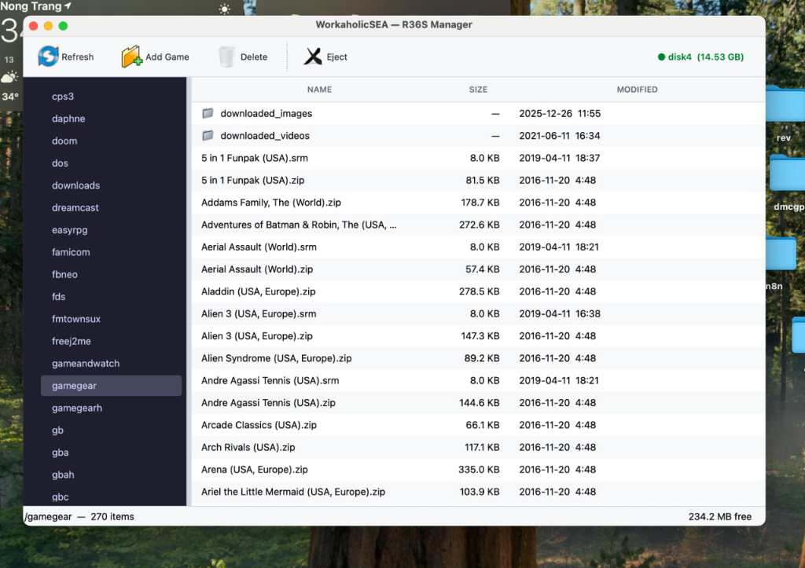

# WorkaholicSEA — R36S Manager

A native macOS desktop application designed to manage game files (ROMs) on R36S retro handheld SD cards. 

Because macOS natively blocks modifying FAT32/exFAT partitions that are located behind Ext4/Linux partitions (a common layout for R36S SD cards running ArkOS/AmberELEC), managing games via standard Finder is typically impossible. This application bridges that gap by directly parsing the Master Boot Record (MBR) and utilizing `mtools` to read, write, and manage files without requiring macOS to mount the partition.

## Features
- **Native UI**: Built with PySide6 (Qt) for a clean, native macOS look and feel.
- **Direct Hardware Access**: Reads raw block devices (`/dev/rdiskX`) to bypass macOS filesystem mounting restrictions.
- **Auto-Detection**: Scans physical disks and automatically identifies the R36S FAT32/EASYROMS partition via partition table offset calculations.
- **File Management**: 
  - Drag and drop ROMs directly into the application.
  - Delete unwanted games easily.
  - Sidebar with quick-search filtering for consoles (e.g., gba, snes, psx).
  - Breadcrumb navigation (Back/Forward/Up).
- **One-Click Launcher**: A `.command` file is provided for easy launching via Finder.

## Prerequisites
- macOS
- **For regular users**: None! The application is distributed as a standalone `.dmg` installer.
- **For developers/building from source**: Python 3.9+ and `mtools` installed via Homebrew.

## Installation

### Method 1: Standalone Installer (Recommended)
Download and open `dist/R36S_Manager.dmg`, then drag **R36S Manager.app** to your **Applications** folder. All dependencies (including `mtools` and python binaries) are fully self-contained.

### Method 2: Build or Run from Source
Use the unified management script `manage.sh`:
- **Setup Environment**: `./manage.sh setup` (installs python packages and dev requirements).
- **Run App**: `./manage.sh run`.
- **Build DMG Installer**: `./manage.sh build`.

Running `./manage.sh` without arguments opens an interactive CLI control panel.

## Permissions
Because the application reads raw disk blocks, it requires administrative privileges to access `/dev/diskX`. The application will automatically prompt for temporary administrative permissions using standard macOS dialogs when scanning.

## Usage
- **Refresh**: Scans for connected physical SD cards.
- **Add Game**: Opens a file dialog or allows drag-and-drop.
- **Delete**: Removes the selected ROM.
- **Eject**: Safely unmounts and ejects the SD card from the system.

## Architecture & Project Structure
- `app.py`: Main application entry point containing PySide6 UI logic, layouts, and drag-and-drop operations.
- `r36s_device.py`: Handles MBR partition layout parsing, SD card raw sector access, and coordinates with bundled `mtools` executables.
- `image_editor.py`: Boot partition editor for modifying system assets on backup `.img` disk images.
- `build_app.py`: Automates compilation of the standalone application bundle and building the DMG installer.
- `manage.sh`: Interactive command control panel to setup, run, and compile the workspace.
